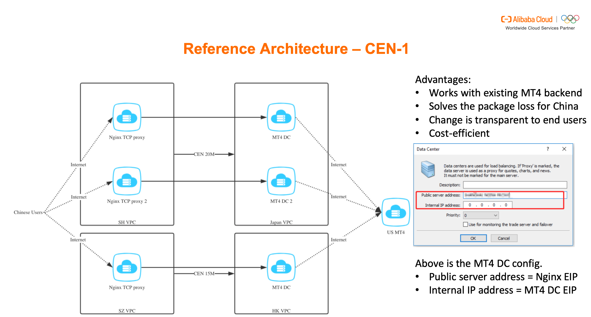
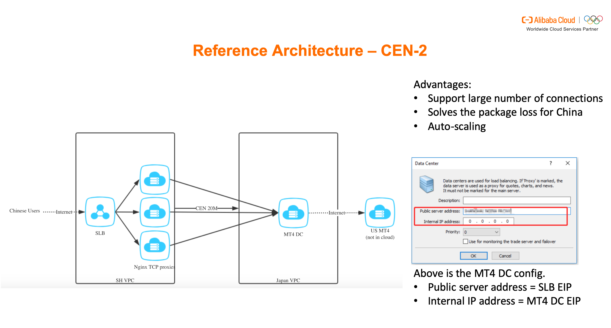
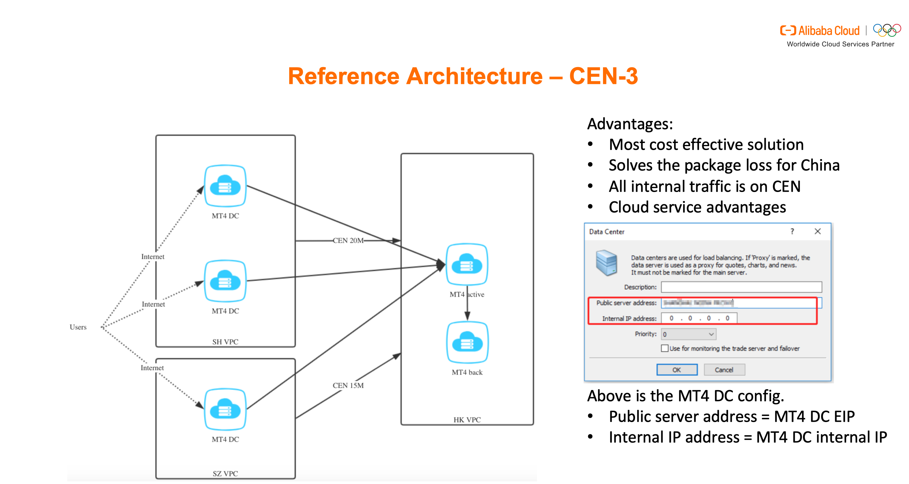
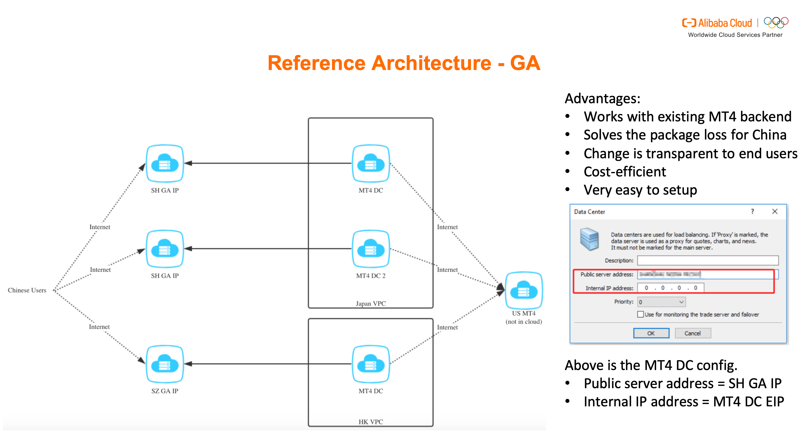

# How Forex Companies Use the Cloud

## THE FOREX INDUSTRY IN THE CLOUD
Forex traders are increasingly moving to the cloud to execute their trading strategies thanks to the convenience of cloud-based solutions.

With cloud computing, instead of building a dedicated data center to enable their online platforms, Forex businesses can rent an elastic cloud computing solution at minimal cost.
As a result, traders can leverage the cloud to check new trading strategies, execute trades and conduct time series analysis to make the right decision, at the right time.

### GLOBALIZATION AND THE CLOUD

Forex is a global marketplace. Trading is not done at one central location but is conducted between traders over the phone and using electronic communication networks in various markets around the world.

The Forex market isn’t dominated by a single market exchange but instead involves a global network of exchanges and brokers around the world.

Just as the Forex market is a global phenomenon, so is the cloud. As such, cloud-based solutions are perfectly placed to meet the global requirements of the Forex market as cloud providers offer an expanding network of nodes and deployment regions, allowing traders to seamlessly do business around the world.

At Alibaba Cloud, for example, we operate in 60 availability zones in 20 regions around the world – with more global regions set to follow.


### CURRENT CHALLENGES

For Forex companies wanting to leverage the cloud, you must address a range of challenges to ensure the security and resilience of your cloud-based operations.

#### Network
The biggest issue many Forex traders face is latency – where trades need to take place on a global scale and, yet, even a five-millisecond delay can make or break a major deal.

How can you achieve seamless connectivity on a worldwide trading stage? You may assume that by utilizing a network environment like the cloud, your risk of network latency will increase, compared to an on-site data center solution. However, many cloud computing environments now offer low latency applications for high-speed trading, fast management and real-time threat prevention.


 For example, our  [Cloud Enterprise Network](https://www.alibabacloud.com/product/cen)(CEN) provides a distributed and hybrid global network that’s ideal for FX businesses that require extensive network coverage, often under high demand. Any of the network instances attached to our CEN can communicate with each other at high speed, high redundancy and low latency, for example the network latency between Beijing DC to Frankfurt DC is around 120 ms with nearly 0 percent package loss via CEN.

 
 CEN also gives traders access to multiple [Virtual Private Clouds ](https://www.alibabacloud.com/product/vpc) (VPCs) and regions, providing low latency communications between multiple regions such as China and the trading capitals of Frankfurt or London, for example.


#### Security

Security and resilience are paramount concerns for the Forex industry – and for good reason. All manner of cyber criminals now use a range of online attacks to penetrate servers in the financial services industry.


Alibaba Cloud is committed to safeguarding the cloud security for every business. We offer a robust set of solutions at every security level, including your application, data and platform security layers.
Our comprehensive Security Services defend against 800 million attacks every day and across 194 countries.
To further protect your network, using CEN, your traffic goes through our highly secure backbone network and never passes through a public network, for example.
CEN also features high availability and network redundancy. Between any two access points, there are at least four redundant links. If a link fails, CEN maintains normal service without network jitter or interruptions.

#### Regulation
Global compliance is a necessity in the Forex industry where you need to adhere to domestic and international information security standards, as well as industry requirements.
At Alibaba Cloud, we engage with independent third parties to verify our compliance according to various requirements.
More specifically, we have helped business obtain an ICP license in China thanks to our expertise of this country’s market.


## ALIBABA CLOUD: VERTICAL SOLUTIONS
Now, let’s look in more detail at some of the cloud-based solutions Alibaba Cloud provides to address the challenges faced by many modern-day Forex companies.
### CROSS-REGION CONNECTION
Forex businesses operating on a global scale often need to access trading servers hosted inside and outside of their region.
Generally, access to trading servers across geographical borders occurs via the Internet and a proxy server. This usually results in a jittery connection, which is susceptible to high packet loss rates, latency issues and an inferior user experience.

Our CEN and [Global Acceleration ](https://www.alibabacloud.com/product/global-acceleration)  (GA) solutions address these challenges. CEN provides a safe and reliable, private communication environment with multi-link redundancy to guarantee high-quality communication. Any network instances attached to the CEN are interlinked and can communicate with each other, across regions.
For example, you could create a CEN instance to connect Virtual Private Clouds (VPCs) between the Beijing and Hangzhou regions
of China. It’s a very simple process, you just need to create a CEN instance and attach the VPC networks to be connected to the other region’s CEN instance. Then, purchase a bandwidth package and set up cross-region bandwidth.

CEN bandwidth packages can be automatically scaled based on different metrics and timing events, using [CEN-Scaler](https://github.com/arafato/CEN-Scaler) on GitHub. The project ships with Alibaba Cloud Function code and Terraform templates enabling users to quickly and easily set up all the necessary configurations and services.
CEN-Scaler could help you to dynamically up or downscale the region bandwidth between central Europe and Beijing for a certain length of time, whenever a certain threshold is reached. For example, it could be used to upscale the bandwidth by 1MB/second each time the utilization of the current bandwidth exceeds 90 percent for more than two minutes.
CEN-Scaler works by either changing the bandwidth specifications based on a specified timing event, or reacts to Cloud Monitor Service alarms defined on certain metric thresholds.
Three typical CEN reference architectures:


On Nginx Proxy server:
```bash
apt update
apt install nginx
vim /etc/nginx/nginx.conf
```
Modify /etc/nginx/nginx.conf

```
user www-data;
worker_processes auto;
pid /run/nginx.pid;

events {
        worker_connections 1000;
}

stream {
    upstream web_server {
        server MT4_DC_internal_IP:443;
    }

    server {
        listen 443;
        proxy_pass web_server;
    }
}

```
then 

```bash
systemctl restart nginx
systemctl enable nginx
```





Our Global Acceleration solution is a network acceleration solution.
It can help you further extend your network, without any of the issues often associated with global communications.
For example, if you subscribe to GA within China, you could deploy a proxy server in a nearby country, like Japan (for access to US Servers) or Hong Kong (to access European Servers).
GA is a new solution where, previously, you would have to access our Express Connect services and a set of reverse proxy servers hosted in China.


However, by using GA, any traffic from China is directly delivered to an internal [Elastic Compute Service](https://www.alibabacloud.com/product/ecs)  (ECS)  or [Server Load Balancer](https://www.alibabacloud.com/product/server-load-balancer) (SLB) to provide a stable connection.

### GLOBAL SECURITY PROTECTION
Alibaba Cloud provides an extensive range of security solutions to protect its customers.
In the Forex market, our [Security Center](https://www.alibabacloud.com/products/threat-detection)  , [Anti-DDoS](https://www.alibabacloud.com/product/anti-ddos) , [Web Application Firewall](https://www.alibabacloud.com/product/waf) (WAF) and [Cloud Firewall](https://www.alibabacloud.com/products/cloud-firewall)  are popular solutions, providing the DDoS mitigation, web endpoint protections, centralized security operations and application data protection to protect your financial≈data.

Our Anti-DDoS Premium service mitigates Distributed Denial of Service (DDoS) attacks, which make websites and other online services unavailable by flooding or crashing the network with too much traffic.

Our Anti-DDoS Premium service deals with such attacks on servers deployed outside Mainland China. Using Alibaba Cloud’s network of scrubbing centers, Anti-DDoS Premium automatically diverts DDoS attack traffic to the nearest center.
This service provides a dedicated IP for every user, which is isolated to minimize the impact of a DDoS attack against other users. We also provide customers with detailed traffic reports and attack protection reports in real time, so you have a clear overview on the security of your business.

Our Web Application Firewall (WAF) solution filters out massive numbers of malicious intrusions to ensure your application endpoint security. It detects and blocks malicious traffic directed to your websites and applications, including SQL injection attacks, cross site scripting attacks and web-shell uploading.

For those Forex businesses operating in China, Cloud Firewall is a comprehensive network security solution. It supports functions including centralized policy management, network-wide traffic identification and intrusion detection.

Simply put, it controls the access traffic running to and from the Internet to your ECS instances, and between your ECS instances. For example, you could use the solution’s embedded Intrusion Prevention System (IPS) to protect your HTTP and other businesses exposed to the Internet.

You could also prevent abnormal external connection activities by analyzing access traffic on your network.
Security Center is a unified security management system that recognizes, analyzes, and alerts users to security threats in real-time. With security capabilities such as ransomware protection, anti-virus protection, web tamper protection, and compliance assessments,users can automate security operations, responses, and threat tracing to secure cloud and local servers and meet regulatory compliance requirements.

### DEDICATED HOSTING USING BAREMETAL
Forex companies often experience periods of high and low network demand and, during both the peaks and troughs, you also need to ensure the high-performance of your servers.

This is where our [ECS Bare Metal Instances](https://www.alibabacloud.com/product/ebm) can help. Basedon next-generation virtualization technology, these instances feature both the elasticity of a virtual server and the high- performance and user experience of a physical server, without any virtualization overheads.

In other words, this gives Forex companies the best of both worlds. Compared to peer services, an ECS Bare Metal Instance with eight vCPUs can provide a core frequency of 3.7 GHz to 4.1 GHz for better performance and a faster response.1
ECS Bare Metal Instances also use a chip-level trusted execution environment in addition to physical server isolation. As a result, your encrypted data can only be computed in a secure and trusted environment.

### FACILITATE BUSINESS LANDING IN CHINA
As the number one cloud provider in China, Alibaba Cloud provides a range of solutions to help Forex businesses tap into and scale up in China.

[China Gateway](https://www.alibabacloud.com/china-gateway)  is one of our flagship solutions, which provides a full set of products and services to help Forex businesses tackle the most common issues when entering China.
This includes our ICP Registration service, which is one of the first steps most businesses take before entering China. Alibaba Cloud works with experienced local partners to navigate Forex companies through the complexities of ICP registration.

Our China Gateway Security solution also works in conjunction with our Information Compliance Solution to build water-tight cyber security, risk management and compliance strategies for Forex businesses operating in the China market.
What’s more, our Information Security and Compliance consulting and support service also makes sure your business is on the right side of the law when operating in China.

## CONCLUSION
For the Forex industry, it is vital that traders have the ability to make split-second international trades in an incredibly secure and low latency way. Happily, the cloud provides the necessary compliance, security, resilience and scalability to enable Forex traders to operate successfully on a global scale.

As the convenience of cloud-based solutions, including Cloud Enterprise Network and ECS Bare Metal Instances, become more prominent, Forex traders will increasingly move to the cloud to carry out secure, efficient and compliant trading.
If you would like to learn more about how you can use Alibaba Cloud to improve your business, please contact us at www.alibabacloud.com/contact-sales.
