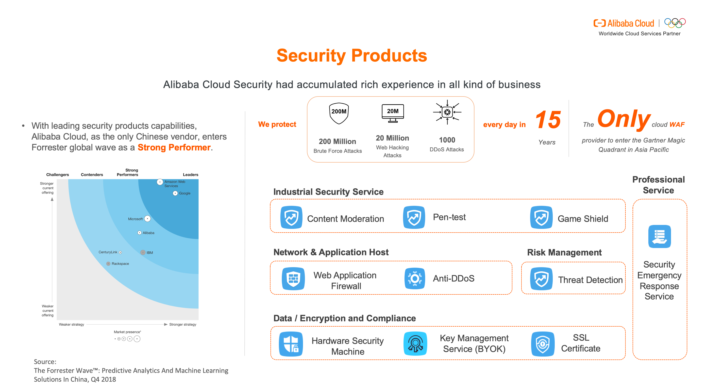
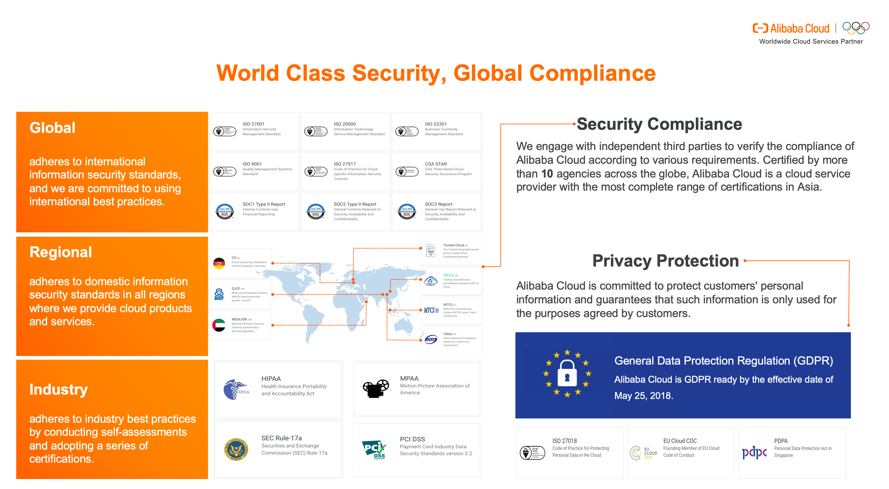

# How Forex Companies Use the Cloud

Forex traders are increasingly moving to the cloud to execute their trading strategies thanks to the convenience of cloud-based solutions.

With cloud computing, instead of building a dedicated data center to enable their online platforms, Forex businesses can rent an elastic cloud computing solution at minimal cost.
As a result, traders can leverage the cloud to check new trading strategies, execute trades and conduct time series analysis to make the right decision, at the right time.

## GLOBALIZATION AND THE CLOUD

Forex is a global marketplace. Trading is not done at one central location but is conducted between traders over the phone and using electronic communication networks in various markets around the world.

The Forex market isn’t dominated by a single market exchange but instead involves a global network of exchanges and brokers around the world.

Just as the Forex market is a global phenomenon, so is the cloud. As such, cloud-based solutions are perfectly placed to meet the global requirements of the Forex market as cloud providers offer an expanding network of nodes and deployment regions, allowing traders to seamlessly do business around the world.

At Alibaba Cloud, for example, we operate in 61 availability zones in 20 regions around the world – with more global regions set to follow.

# CURRENT CHALLENGES

For Forex companies wanting to leverage the cloud, you must address a range of challenges to ensure the security and resilience of your cloud-based operations.

## Network
The biggest issue many Forex traders face is latency – where trades need to take place on a global scale and, yet, even a five-millisecond delay can make or break a major deal.

How can you achieve seamless connectivity on a worldwide trading stage? You may assume that by utilizing a network environment like the cloud, your risk of network latency will increase, compared to an on-site data center solution. However, many cloud computing environments now offer low latency applications for high-speed trading, fast management and real-time threat prevention.

 For example, our  [Cloud Enterprise Network](https://www.alibabacloud.com/product/cen)(CEN) provides a distributed and hybrid global network that’s ideal for FX businesses that require extensive network coverage, often under high demand. Any of the network instances attached to our CEN can communicate with each other at high speed, high redundancy and low latency, for example the network latency between Beijing DC to Frankfurt DC is around 120 ms with nearly 0 percent package loss via CEN.

 
 CEN also gives traders access to multiple [Virtual Private Clouds ](https://www.alibabacloud.com/product/vpc) (VPCs) and regions, providing low latency communications between multiple regions such as China and the trading capitals of Frankfurt or London, for example.

## Security

Security and resilience are paramount concerns for the Forex industry – and for good reason. All manner of cyber criminals now use a range of online attacks to penetrate servers in the financial services industry.

Alibaba Cloud is committed to safeguarding the cloud security for every business. We offer a robust set of solutions at every security level, including your application, data and platform security layers.
Our comprehensive Security Services defend against 800 million attacks every day and across 194 countries.
To further protect your network, using CEN, your traffic goes through our highly secure backbone network and never passes through a public network, for example.
CEN also features high availability and network redundancy. Between any two access points, there are at least four redundant links. If a link fails, CEN maintains normal service without network jitter or interruptions.

## Regulation
Global compliance is a necessity in the Forex industry where you need to adhere to domestic and international information security standards, as well as industry requirements.
At Alibaba Cloud, we engage with independent third parties to verify our compliance according to various requirements.
More specifically, we have helped business obtain an ICP license in China thanks to our expertise of this country’s market.

